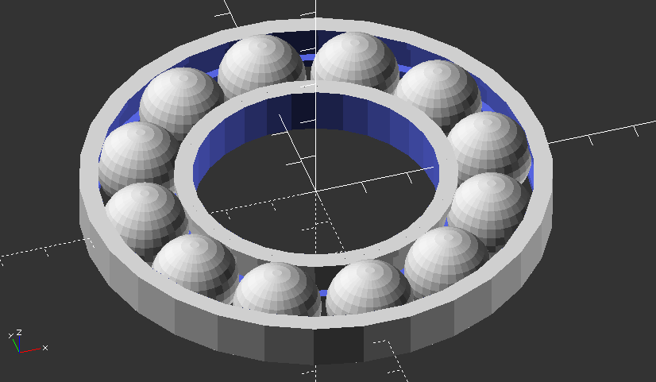
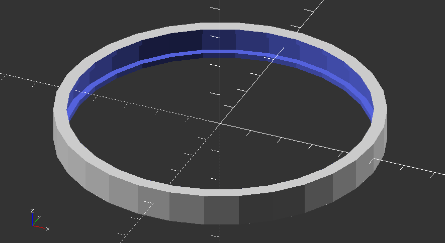
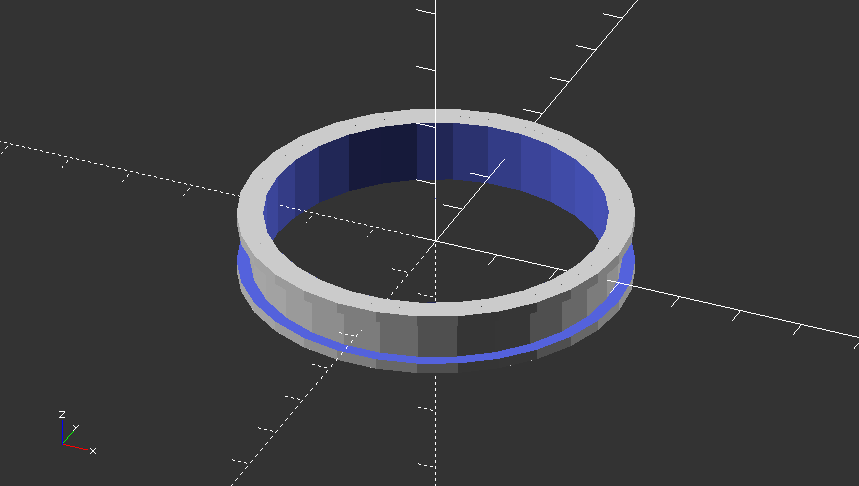
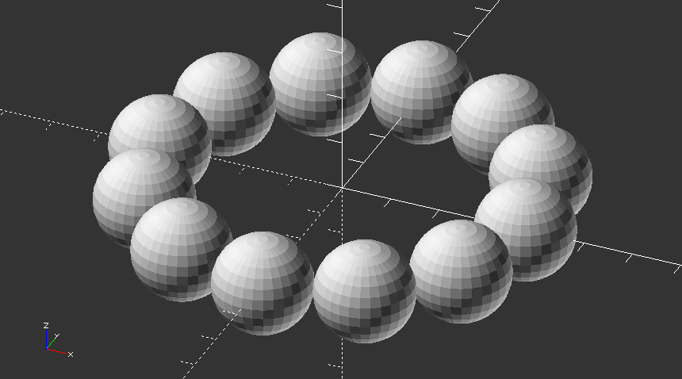
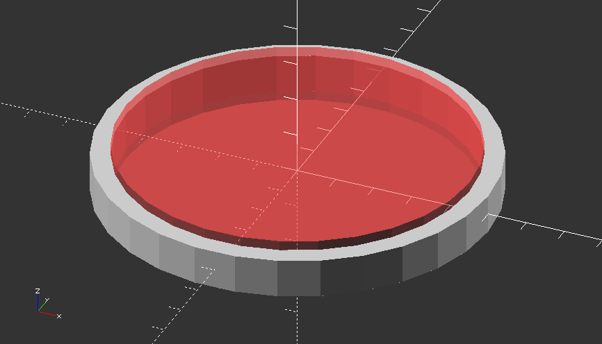
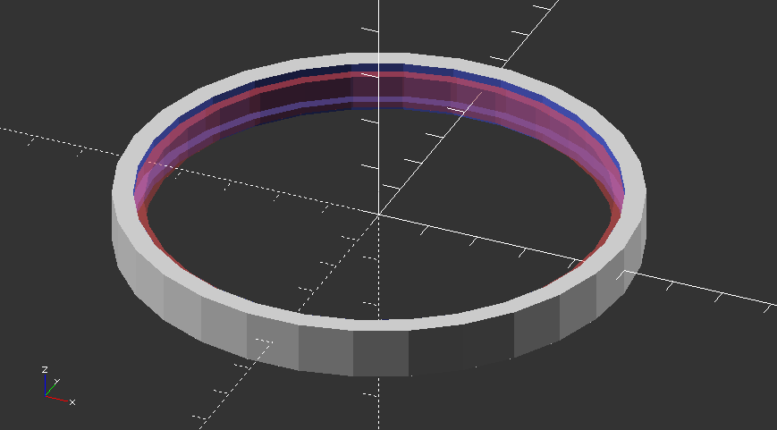

Modellazione di un cuscinetto
=============================

Componenti del cuscinetto
-------------------------
Il cuscinetto è composto da due anelli cavi:

* uno esterno con gola rivolta verso l'interno

* uno interno con gola rivolta verso l'annello esterno

* una serie di sfere

Codice Openscad
---------------

Gli anelli
**********
Gli anelli sono ottenuti come sottrazione di due cilindri.

Le scanalature sono ottenute come sottrazione di due anelli.

Le sfere
********
E' una serie ottenuta mediante un ciclo for::

 for(i=[0:30:360]){
  rotate([0,0,i])
  translate ([37.8,0,0]) sphere(9.90);
 }
